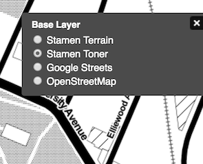
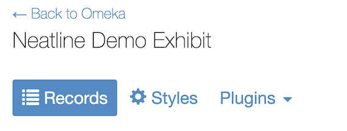
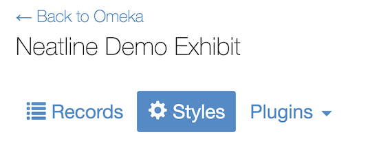
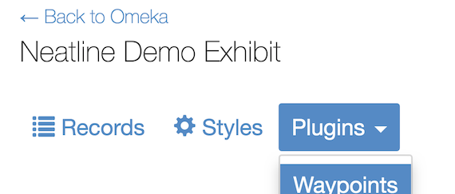

# Neatline Editor: An Overview

## At a glance

- The Neatline editor is the interactive application that allows users to build the content of their Neatline exhibit.
- The [**Records**](#records) tab within the editor is where you create and search for Neatline records, the content of your exhibit.
- The [**Styles**](#styles) tab is where you can set an exhibit's default focus and zoom and use the Neatline stylesheet.
- The [**Plugins**](#plugins) tab allows you to access settings for the enabled Neatline widgets in the exhibit.

## Editor Overview

The Neatline editor is the interface where you build the content of your exhibit. Access the editing enviroment by clicking on the exhibit [title](managing-exhibits.html) in the "Browse Exhibits" view. The left panel within the editor includes tabs for **Records**, **Styles**, and **Plugins**. If there are no plugins (widgets) [enabled](creating-exhibits.html#widgets) for the exhibit, the **Plugins** tab will not be displayed. 

On opening the exhibit editor, your selected [**Default Spatial Layer**](creating-exhibits.html#default-spatial-layer) will appear. For map layers, the default location is set at the coordinates 0° N, 0° E (to change your exhibit's default locations, see [here](exhibit-styles-tab.html#default-map-focus).)

To view the [**Enabled Spatial Layers**](creating-exhibits.html#enabled-spatial-layers) in your exhibit, click on the layers icon on the right side of the page, and select a layer option to change the visible map base layer:

   

**Note:** The [**Default Spatial Layer**](creating-exhibits.html#default-spatial-layer) can only be set in the [Exhibit Settings](creating-exhibits.html#exhibit-settings). 

## Records

Select the **Records** tab to create, search and edit the Neatline records in your exhibit. **Records** are the primary content of the Neatline exhibit, including any vector annotations, timeline and waypoint context, WMS overlay layers, and text annotations in the exhibit narrative. 

For more on **Records**, see the related documentation: [Records Overview](records-overview.html), [Creating New Records](creating-records.html), [Importing Omeka Items](importing-omeka-items.html), [Searching Records](searching-records.html)

## Styles

Select the **Styles** tab to edit higher-level settings for your exhibit. This section includes the following settings:

- The [Neatline Stylesheet](neatline-stylesheets.html), a code editor that uses a simplified, Neatline-inflected dialect of CSS to perform bulk updates on large groups of related records clustered together by tags (see [Editing Record Groups](style-tab-groups.html) for more information about tags).
- [Default Map Focus and Zoom](exhibit-styles-tab.html#default-map-focus) 
- [Restricted Map Extent](exhibit-styles-tab.html#restricted-map-extent)
- [Minimum Map Zoom](exhibit-styles-tab.html#minimum-map-zoom)
- [Maximum Map Zoom](exhibit-styles-tab.html#maximum-map-zoom)

For details on these settings, see [Exhibit Styles Tab](exhibit-styles-tab.html) and [Using Neatline Stylesheets](neatline-stylesheets.html).

## Plugins

Select the **Plugins** tab to display a drop-down list of the [enabled widgets](creating-exhibits.html#widgets) in your exhibit. Select a widget name to edit it's higher-level settings. If this tab is not visible, there are no widgets enabled in your exhibit.

For details on these settings, see documentation on Neatline plugins: [SIMILE Timeline](working-with-the-simile-timeline-widget.html), [Waypoints](working-with-the-waypoints-plugin.html)
