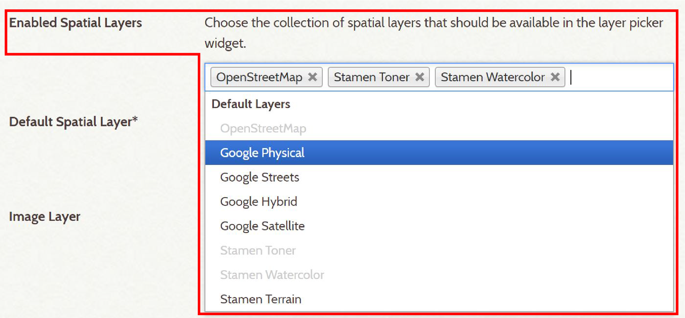
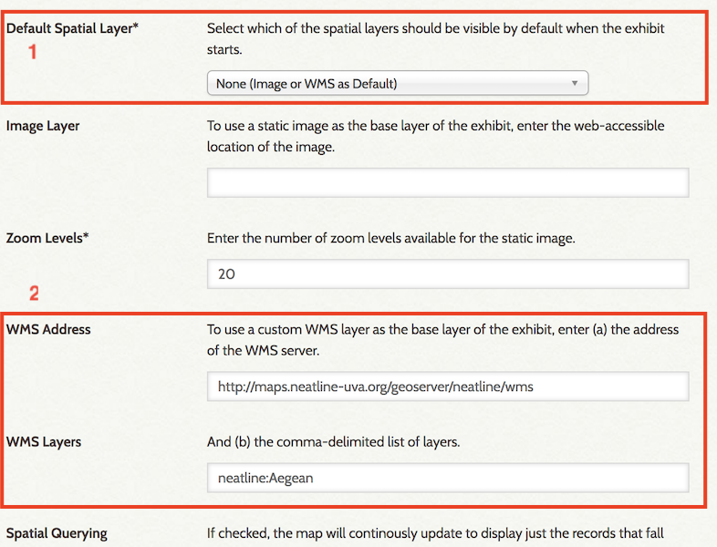

# Map-based Exhibits 

Map-based exhibits are built on top of geospatial layers - OpenStreetMap, the Google API layers, Stamen Design layers, or completely custom tile sets delivered as [WMS layers][wms], [MBTiles][mbtiles], or any other layer format supported by the [OpenLayers][openlayers] mapping library. Out of the box, Neatline comes with a core collection of general-purpose spatial layers, and makes it easy to add custom layers if you need something different.

## Using the Provided Spatial Layers: 

To create a map-based exhibit, follow the instructions for [Creating New Exhibits](creating-exhibits.html), using the following Exhibit Settings:

### Enabled Spatial Layers {#enabled-spatial-layers-1}

This field lists all geospatial layers available to your exhibit by default. These layers are accessible by way of the "layer switcher" tool displayed in the top right corner of the map in the editing environment and public view of your exhibit. Click on the input to display a list of layers, and click on a selection to add:

### Default Spatial Layer 

Select a default spatial layer for your exhibit by clicking on the input to display the list of available layers, and click to select. This will be the layer that's displayed when an exhibit is first accessed. This is an important selection, since the default layer will often strongly influence the visual aesthetic of the exhibit.

## Using a Custom Map Default Layer: 

Neatline exhibits can be customized using georectified historical maps or custom base layers, by publishing the layers to the web using a piece of software called [Geoserver](geoserver), an open-source geospatial server that does the computationally-intensive work of piping the georeferenced image tiles into the Neatline exhibits.

This option is especially useful for historic exhibits, where the contemporary default map layers may not accurately depict historic conditions. Georeferenced spatial layers also provide a method of bringing in other types of geographic spatial data you may have for your exhibit.

**Note: Using this method produces an exhibit with your custom WMS layer as the default layer, with a blank (white) background beyond the boundaries of your custom map. If your exhibit uses multiple historic or custom map layers, and/or you prefer to view your custom map as an overlay to the provided spatial layers (like OpenStreetMap), see the documentation section for Creating Custom Map Overlays and [Editing Imagery](style-tab-imagery.html)**

### Enabled Spatial Layers 

You may still want one or more of the provided spatial layers to be available in your exhibit, if so, follow the [instructions above](#enabled-spatial-layers-1) to add these.

### Default Spatial Layer 

1. Select the option 'None (Image or WMS as Deafult)' for the Default Spatial Layer.

2. Load your georeferenced map into Geoserver as a WMS (Web Map Services) layer. In the Neatline Exhibit Settings, fill in the the top-level WMS address for the GeoServer installation (this always ends with /wms, and might look something like localhost:8080/GeoServer/wms). In the field for WMS Layers, enter the layer that you want assigned as the exhibit default spatial layer. 

(Note: only one WMS Layer can be included in the Exhibit Settings, see [Editing Imagery](style-tab-imagery.html) for including multiple custom map layers in your exhibit.)

[geoserver]: http://geoserver.org/
[mbtiles]: http://www.mapbox.com/developers/mbtiles/
[wms]: http://en.wikipedia.org/wiki/Web_Map_Service
[openlayers]: http://openlayers.org/
